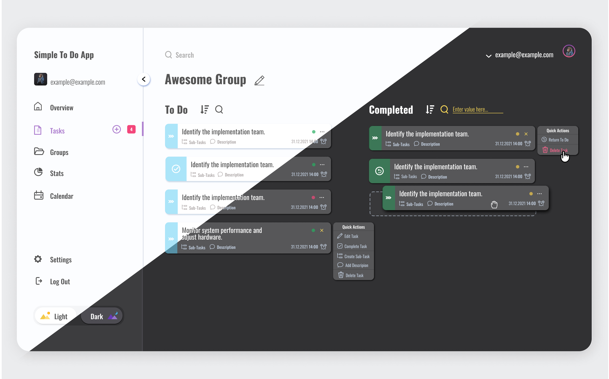
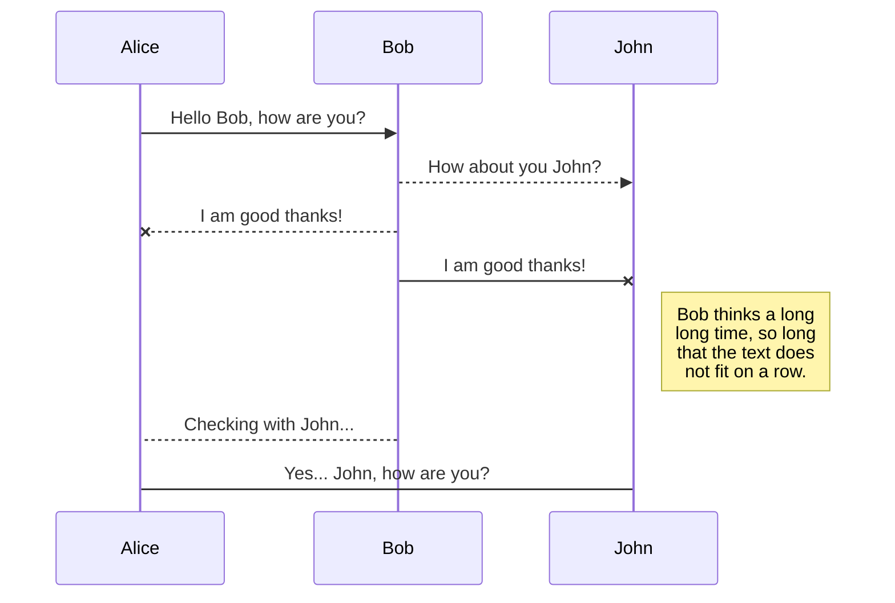
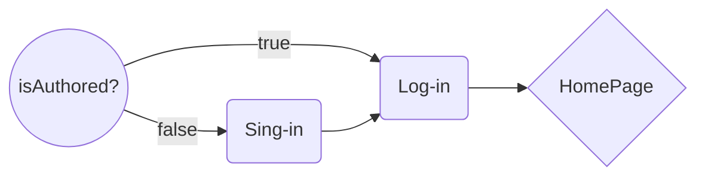

# SimpleToDo-React App

## About 💁

I have started this project with the purpose of learning how to structure a Web App of a base-level complexity integrating the Redux logic.

At the time of the creation of the application, I have no experience with either Redux, or with a ReactJS, or with other technologies, only the experience of HTML, CSS and Vanilla JS ES6+

## Application Design

## 🚀 Technologies

- **ReactJS**
- **React Router**
- **Redux**
- **Styled-Components**

## To Do

- [ ] Add favicon

## Diagrams

Need to edit a flow chart:

